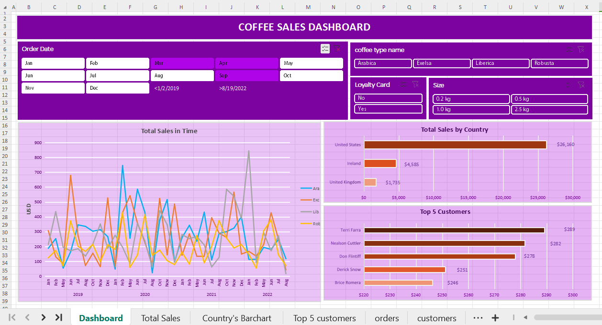

# Excel Dashboard Progect - Coffee Sales
**Overview**

This Excel project provides a comprehensive analysis of a Coffee Sales Data. The workbook includes various sheets and visualizations to explore the data and uncover key insights.

**Key Features**

* **Data Analysis:** Detailed analysis using pivot tables and pivot charts.
* **Visualizations:** Clear and informative charts and graphs to illustrate findings.
* **Interactive Elements:**  Used  filters or slicers to make the eelments interactive.
* **Calculations:** calculations and formulas(VLOOKUPs,XLOOKUPs) to derive meaningful metrics.

**How to Use**

1. **Open the Workbook:** Launch Microsoft Excel and open the `coffeeOrdersDataProject.xlsx` file.
2. **Navigate the Sheets:** Explore different sheets to access specific data and visualizations.
3. **Interact with Visualizations:** Click on elements in charts and graphs to drill down into details.
4. **Modify Data:** Update the source data to reflect changes and rerun calculations.

**Additional Notes**

* **Data Sources:** The data used in this project was sourced from [(https://github.com/mochen862/excel-project-coffee-sales/blob/main/coffeeOrdersData.xlsx)].

